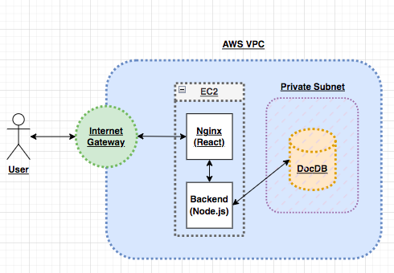

# AWS DocumentDB, EC2, Nginx, and Node.js for Cloud Development

## Key Things to Note
- The <b>AWS DocumentDB</b> resides in a private subnet within an AWS VPC
- We have not covered networking as of yet in AWS (VPC, subnets, security groups, nACLs, gateways, etc.), but the key takeaway is that we require another service <b>within the same VPC</b> in order to communicate with <b>AWS DocumentDB</b>
- We can use <b>AWS EC2</b> which is basically a virtual web server in the cloud which allows us to configure and run both the front-end and back-end applications simultaneously
- <b>AWS EC2</b> will be connected to the <b>same VPC</b> as the DocumentDB cluster which will enable communication
- We will not run this web application locally, it is of no use. In order to understand how to work with DocumentDB, we will need to configure the development environment within an EC2 instance and work from there
- <b>You will need to edit the front-end axios URLs used to make requests to the back-end server hosted on the EC2 instance. The format is http://<Public__Address\>:<Port\>/\<endpoint\></b>

## Brief Overview of Configuration

- We will make use of Nginx to host the React application
- Process manager (pm2) to run the node server in the background 
- Configure environment variables
- Install the necessary dependencies (npm install),
- Modify localhost settings within the front-end code to ensure that communication with the EC2 instance public IP address  is used for accessing back-end resources

## Diagram for Further Clarity
- The following is a diagram which summarizes all the above points:
- 

## Medium Article as a Complete Guide
- You can refer to the following <a href=""><b>article for further clarity</b></a>